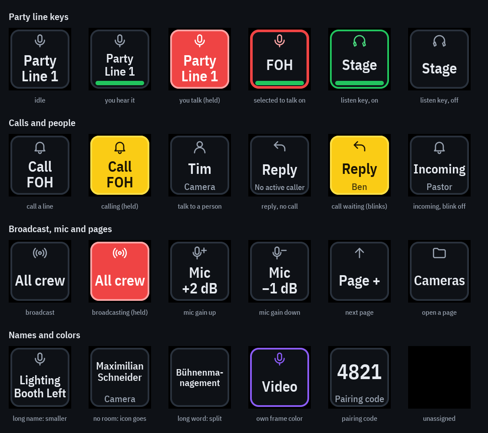

# Kesher visual system

The rules every screen follows: station view (browser, desktop app), admin
console, login. The values live in
[`packages/client-core/src/styles/tokens.css`](../../packages/client-core/src/styles/tokens.css)
as `--k-*` variables. New and reworked UI uses only those.

Where things live in `packages/client-core/src`:

- `styles/tokens.css`: the values (colors, type, spacing, radii).
- `styles/theme.css`: older variable names still used in `app.css`, each
  pointing at a token. No raw colors there; drop a name once nothing uses it.
- `styles/app.css`: component styles. Base controls (`input`, `select`,
  `button`) are 44 px with radius 10; button kinds are `.primary`,
  `.secondary` (also plain `<button>`) and `.danger`; icon-only buttons use
  `.k-icon-button`.
- `components/Icon.tsx`: the icon set (`<Icon name="headphones" />`).
- `components/settings/`: the user settings dialog, one file per page
  (sound, Stream Deck, shortcuts). `SettingsParts.tsx` holds the pieces
  every settings page uses: a group with a title and an on/off switch with
  a one-line hint. New settings use these instead of their own markup.
- Fonts: IBM Plex is bundled (`@fontsource/*`), so it works on a LAN
  without internet.

The approved draft (visual system, station desktop and phone, clickable) is the
design canvas "Kesher Redesign Entwurf" on claude.ai:
https://claude.ai/artifact/8u2zw6mdKvHFtbAvEFCvgw (private; share it from its
page to give others access). Decision: [0007](../decisions/0007-visual-system.md).

## 1. Colors have one meaning

In an intercom a color must be readable without thinking, so each signal
color means the same everywhere (station, Stream Deck images, admin).

| Variable | Color | Means | Used for |
| --- | --- | --- | --- |
| `--k-hear` | green `#22C55E` | you hear it / someone is heard | headphone toggle on, "Ben is talking", listener counts |
| `--k-on-air` | red `#EF4444` | your microphone goes out | talk button while held, mic pill "On air", the line you talk on |
| `--k-call` | yellow `#FACC15` | someone calls | incoming call on a line or from a person, until answered |
| `--k-attention` | orange `#FB923C` | something is wrong | no microphone, station waiting, server warning |
| `--k-selection` | cyan `#22D3EE` | where you are | navigation, focus, primary button. Never a status. |

Neutrals: ground `#0E1116`, surface `#161B22`, raised `#1E2530`, border
`#2A323D`, text `#E6EAF0` / soft `#C9D1DB` / muted `#9AA4B2`.

Signals never rely on hue alone: each state also has a word ("On air",
"Ben is talking", "Call from Tim") and, where it fits, an icon.

## 2. Type

- IBM Plex Sans; numbers (dB, counts, codes) in IBM Plex Mono.
- Sizes: 28 (display, talk button), 18 (titles), 15 (body, buttons), 13
  (labels, status lines). Nothing smaller than 12.
- Normal case. Capitals only on the talk button. No letter-spaced
  "SHOUTING LABELS".

## 3. Shapes and space

- Spacing 4 / 8 / 12 / 16 / 24 / 32.
- Radius 10 for controls, 12 for cards, 14 for panels.
- Everything you press is at least 44 px high.
- One border per layer: a card on the ground has a border; things inside a
  card are separated by a line, not another box.

## 4. Buttons and icons

- Three button kinds: primary (cyan fill, dark text), secondary (border
  only), danger (dark red, light red text). 44 px high.
- One stroke icon set (24 px grid, stroke 1.8, round caps): mic, headphones
  (hear), bell (call), pin, reply, settings (sliders), lock, broadcast.
- Icon-only buttons carry an `aria-label`; header actions (settings, lock)
  are icon buttons, everything else icon plus word.

## 5. A party line, in every state

A card is a press area (name + status line) and a row below it (hear toggle,
call, volume value).

| State | Frame | Status line |
| --- | --- | --- |
| Idle | border | "Not listening" (muted) |
| Hearing | border, headphones green | "Listening · 3" (green) |
| Someone talks | green | "Ben is talking" (green) |
| You talk (held) | red, red tint | "On air" (light red) |
| Called | yellow, yellow tint | "Call from Tim" (yellow) |

On a phone the cards become a list: the row is the talk area, the
headphones are a square button on the right. Talk and reply sit in a fixed
bar at the bottom; volume opens from the value ("0 dB") instead of a
slider on every card.

## 6. Stream Deck keys

Kesher draws the key images itself (`backend/internal/app/key_render.go`,
see [IMAGE-STREAM-BRIDGE](../IMAGE-STREAM-BRIDGE.md)) with the same rules.
Every design at a glance (regenerate with
`KESHER_KEY_SHEET=../../../docs/design go test -run TestKeyDesignSheet ./internal/app`
in `backend/`):

**Build of a key** (72 px key; larger decks scale it):

- Black key, a card inset 2 px with radius 10 and a 2 px frame.
- Top: the icon of the key's kind (18 px). Middle: the name. Bottom: the
  second line (one line, smaller, muted). A green bar under it when you
  hear the line.
- Type: IBM Plex Sans Condensed, SemiBold for the name, Medium for the
  second line, embedded from `backend/internal/app/fonts` (SIL Open Font
  License next to the files).

**Colors carry the state, never the kind:**

| Key shows | Means |
| --- | --- |
| neutral card, grey frame | idle |
| red fill | your microphone goes out (talk, reply, broadcast held; mic open) |
| red frame | this is the line you talk on (selected), like an armed card in the app |
| green bar at the bottom | you hear this party line |
| green frame and icon | a listen key that is on |
| yellow fill | someone calls you (blinks every 300 ms), or you hold a call key |
| darker card | you hold a key that sends no audio (page, mic gain, listen) |
| own frame color | chosen in the editor only to tell keys apart (no red, green or yellow) |

**Icons tell the kind:** mic (talk keys, mute), headphones (listen), bell
(call a line, incoming calls), person (talk to a person or role), reply,
broadcast, mic with + or − (mic gain), arrows and house (pages), folder
(open a page). They use the paths of `components/Icon.tsx`.

**Names:**

- The name always wins. It gets the largest size that fits completely on
  up to three lines (two lines are split evenly: "Party / Line 1").
- If it does not fit next to the icon at 13 px, the icon is left out.
- Only then are long words split with a hyphen ("Bühnenma-nagement"); "…"
  is the very last resort. The second line is cut with "…" when too long.
- Keys name themselves from their action when the name is empty: the party
  line, the person (with their role below), "Mic +2 dB" / "Mic −1 dB" for
  mic gain (the sign is the direction), "Page +", the page's name.
- An unassigned key stays black.

**In the layout editor** a key has a name (empty = automatic, the editor
shows the automatic name as placeholder) and an optional second line; both
are stored as one label, `name\nsecond line`, so `\nStage left` keeps the
automatic name. Frame colors are swatches; the selected key is also shown at
about its real size.
